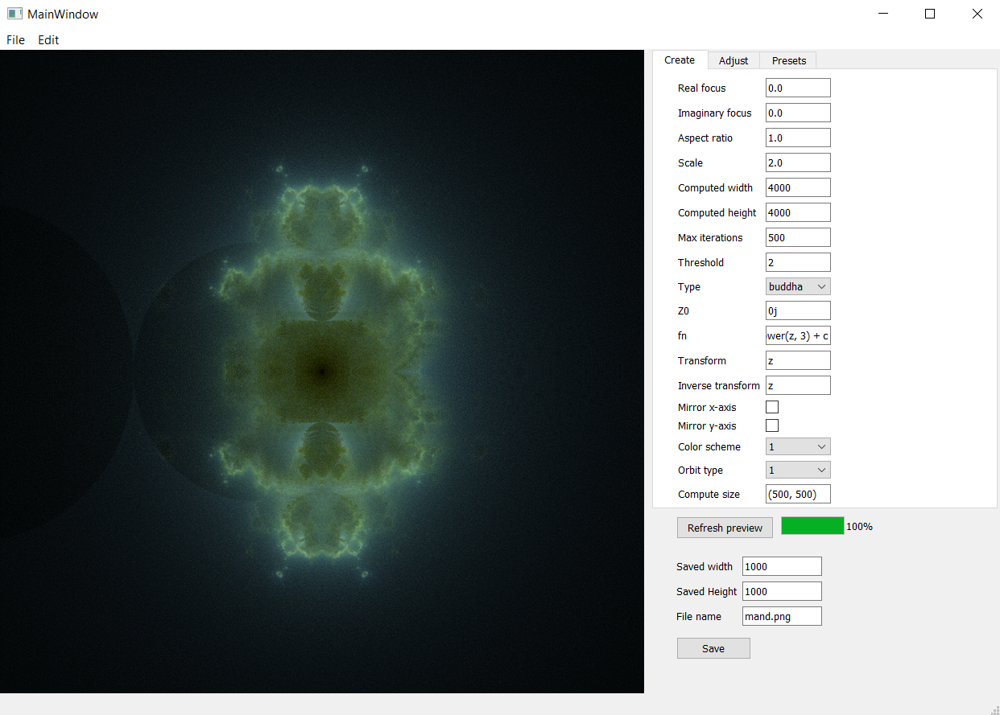
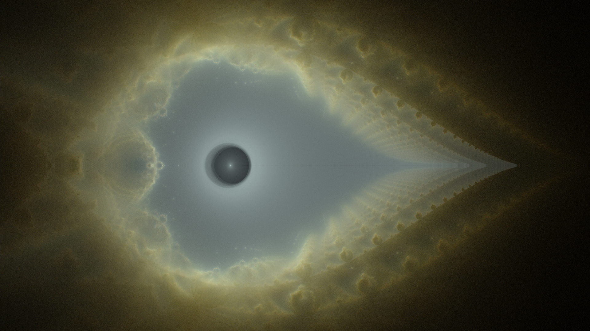
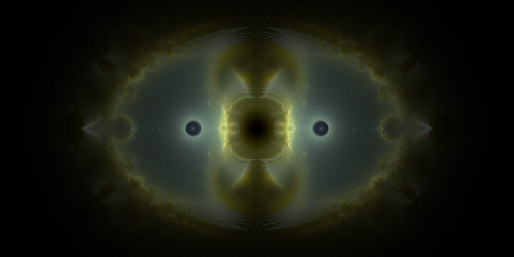

# mandelpy
A Mandelbrot and Buddhabrot viewer with GPU acceleration using NVIDIA's CUDA toolkit.

# Showcase






# What makes this different?

There are tonnes of mandelbrot programs, but this is special in 3 ways: 
 - It is the only one that provides a `transform` setting to everything. This means that every
  point `z` on the screen goes through a that transform which can completely
 change the shape of the output into something never seen before.
 
 - There is also zero randomness for all buddhabrots which is rares with these projects. 
 I like to think that it makes computation faster.
 
 - It is GPU accelerated and is sometimes faster than previous accelerated Java and C++ 
 applications even though the whole project is written in pure python.

# Installation

You can clone this repository however you feel. 

One way would be using the command line:

```commandline
git clone https://github.com/Maelstrom6/mandelpy
```

# Requirements
- Python 64bit

- NumPy

  Standard I assume.

- Pillow

  The main image manipulation library.
  
- imageio

  To create GIFs if wanted
  
- Numba

  Requires the Python 64bit interpreter. Chances are, if you managed to install TensorFlow for
  GPU, you would simply be able to install it with no problems
   and no extra steps. 
  Otherwise, according to
  [their documentation](https://numba.pydata.org/numba-doc/latest/cuda/overview.html#requirements), 
  one needs the CUDA Toolkit 8.0 or later. Please run the `numba_cuda_test.py` to check if
  everything is working properly which is located in [user_utilities](user_utilities).

- PyQt5

  Required for the user interface. PyQt5-tools is not required.

# Usage

Please see [program_examples](program_examples) and [the showcase](images/showcase) for examples
 on how to use the core package. 
 
Please run [main.py](gui/main.py) in the gui folder in order to use the GUI.

# Goals
 - Add new color schemes.

 - Add tooltip text to all settings on the GUI.

 - Set up 'undo' and 'redo' functionality in the GUI.
 
 - Decide how the GUI should look on startup and after pressing 'New'.

 - Find a way to evaluate string input as functions without the `eval` method.
 
# Contributing

Contributions are highly appreciated especially bug fixes, new color schemes and presets.